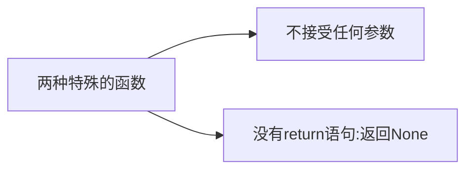

# Part.2.D.1-2
## 函数（变量）命名
1. 名称不能以数字开头。开头只能用大小写字母与下划线
2. 名称不含有空格
3. 名称不能与Python 关键字重合

验证是否关键字的程序：
`import keyword
keyword.kwlist` #关键字列表
`keyword.iskeyword('if')` #查询

## 两种特殊的函数

## 函数的参数

接收参数-->单个参数:`def fun(m)`

接收参数-->多个参数:`def fun(m,n)`

## 全局变量与局域变量
- 函数内部声明的变量为 局域变量（Local Variables）
- 外部调用该函数时，传递的不是该变量，而是该变量的值，故函数之后是对该值进行处理，**不改变**原来的全局变量的值；但是若函数内部被传过来的是**可变容器**（eg.List）,那么原容器的值会发生变化
- 故一般在使用列表的值时，使用其 copy值
```
def be_careful(a, b):
    a = 2
    b_copy = b.copy()
    b_copy[0] = 'What?!'

a = 1
b = [1, 2, 3]
be_careful(a, b)
a, b
```
## 位置参数与关键字参数

- 函数定义时各种参数的排列顺序：
  1. Positional Argument
  2. Arbitrary Positional Arguments（可以接收一系列值的位置参数）
  3. Keyword Argument
  4. Arbitrary Keyword Arguments（可以接收一系列值的关键字参数）
- 从用户角度看，（Keyword Argument）中这些设定了默认值的参数，就成了“可选参数”
|          | Arbitrary Positional Arguments                               | Arbitrary Keyword Arguments                                  |
| :------: | :----------------------------------------------------------- | :----------------------------------------------------------- |
| 表达形式 | def say_hi(*names):                                          | def say_hi(**names_greetings):                               |
| 迭代方式 | 任意容器                                                     | 字典                                                         |
| 调用方式 | *任意容器（eg.\*a_list）                                     | **dict                                                       |
|   实例   | def say_hi(\*names):<br/>    for name in names:<br/>        print(f'Hi, {name}!')<br/><br/>a_string = 'Python'<br/>say_hi(\*a_string)<br/><br/>a_range = range(10)<br/>say_hi(\*a_range)<br/><br/>a_list = list(range(10, 0, -1))<br/>say_hi(\*a_list)<br/><br/>a_dictionary = {'ann':2321, 'mike':8712, 'joe': 7610}<br/>say_hi(*a_dictionary) | def say_hi(\**names_greetings):<br/>    for name, greeting in names_greetings.items():<br/>        print(f'{greeting}, {name}!')<br/>        <br/>a_dictionary = {'mike':'Hello', 'ann':'Oh, my darling', 'john':'Hi'}<br/>say_hi(\*\*a_dictionary) |

# Part.2.D.3 
## 化名

`year_leap_bool = _is_leap` 的时候，相当于给 `_is_leap() `这个函数取了个化名。
- 取化名的原因：
  1. 提高代码可读性
  2. 避免重名风险
## 匿名函数lambda
`lambda x,y:x+y`（ `:`后只能有一个表达式）
用途：
1. 作为某函数的返回值
```
def make_incrementor(n):
    return lambda x: x + n

f = make_incrementor(42)
f(0)

f(1)
``` 
- f 中保存的函数是 lambda x: x + 42

2. 作为某函数的参数
```
def double_it(n):
    return n * 2

a_list = [1, 2, 3, 4, 5, 6]

b_list = list(map(double_it, a_list))
b_list

c_list = list(map(lambda x: x * 2, a_list))
c_list
```
其中，`map(function, iterable, ...)` `map() `这个函数的第一个参数，就是用来接收函数的。随后的参数，是 iterable —— 就是可被迭代的对象，比如，各种容器，例如：列表、元组、字典什么的。

`pairs = [(1, 'one'), (2, 'two'), (3, 'three'), (4, 'four')]
pairs.sort(key=lambda p: p[1])
pairs`
- `paris.sort(*,key=str.lower,reverse=False)`:`sort`含有两个**关键字参数**,`key`从列表中提取元素 比较键值

## Part.3.B.1 类
